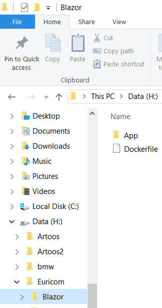
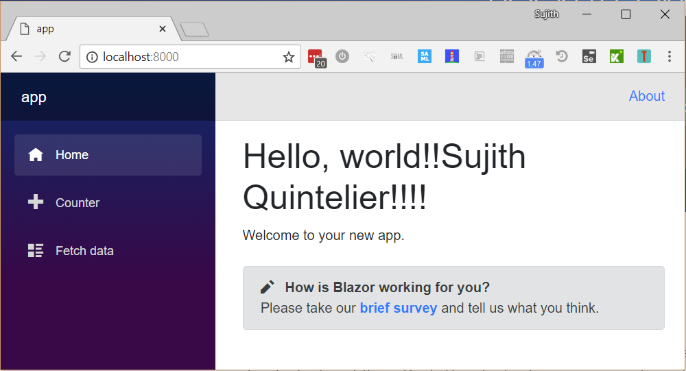
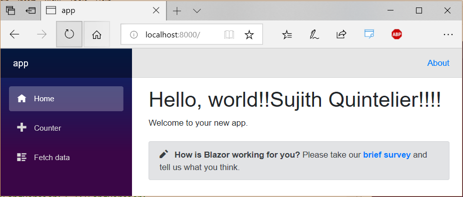
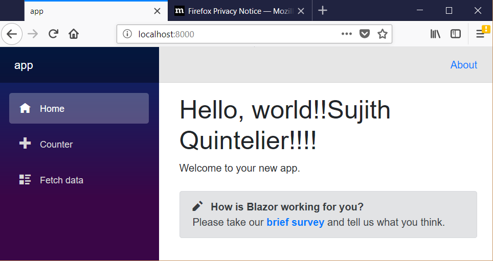

This guide helps you setting up your [Blazor](https://blazor.net/) development environment without messing up your current development machine with beta releases.

We will use these tools

* [Docker Community Edition](https://www.docker.com/community-edition)

* [Visual Studio Code](https://code.visualstudio.com/)

Create a local directory with one subdirectory app.



# Create Dockerfile

First download the latest [dockerfile](https://hub.docker.com/r/microsoft/dotnet/ "dockerfile") version.
Look at the latest version of [Linux amd64](https://github.com/dotnet/dotnet-docker/blob/master/2.1/sdk/stretch/amd64/Dockerfile). 
Copy the raw content and store it in a file Dockerfile. Modify it by appending ` \` and `&& dotnet new -i Microsoft.AspNetCore.Blazor.Templates` at the second RUN command.

It should look like this:

```bash
RUN curl -SL --output dotnet.tar.gz https://dotnetcli.blob.core.windows.net/dotnet/Sdk/$DOTNET_SDK_VERSION/dotnet-sdk-$DOTNET_SDK_VERSION-linux-x64.tar.gz \
    && dotnet_sha512='2166986e360f1c3456a33723edb80349e6ede115be04a6331bfbfd0f412494684d174a0cfb21d2feb00d509ce342030160a4b5b445e393ad83bedb613a64bc66' \
    && sha512sum dotnet.tar.gz \
    && echo "$dotnet_sha512 dotnet.tar.gz" | sha512sum -c - \
    && mkdir -p /usr/share/dotnet \
    && tar -zxf dotnet.tar.gz -C /usr/share/dotnet \
    && rm dotnet.tar.gz \
    && ln -s /usr/share/dotnet/dotnet /usr/bin/dotnet \
	&& dotnet new -i Microsoft.AspNetCore.Blazor.Templates
```


# Create the docker image
Open a terminal and go to the location of the Dockerfile and run `docker build -t blazor:latest .`. This will build the docker image.

If this fails, just restart your docker and rerun previous command.

## build
This builds the image.

## -t
This adds a label `latest`.

## verify
The creation of the image can be verified by `docker images`
You should see 2 images. Base image and the one you just created.


# Start a container instance
At the prompt run `docker run -it --rm --name blazortest -p 8000:80 -v H:\Euricom\Blazor\app\:/app  -w="/app" blazor:latest`

## run
This runs the container:

## -it
This runs an interactive container.

## --rm
This removes the container after stopping the container.

## -p
This maps the internal port (80) to an external port (8000).

## -v
This maps a local path `H:\Euricom\Blazor\app\` to this volume `/app`

## -w
This sets the working directory to `/app`

## verify
In another terminal you should see named instance blazortest


# Create a new blazor project
You can create a new Blazor project the volume created earlier by running this command `dotnet new blazor`.

Open the project file app.csproj and add this node `<Watch Include="**\*.cshtml" />`. This makes it possible to make changes on the fly.


```xml
<Project Sdk="Microsoft.NET.Sdk.Web">

  <PropertyGroup>
    <TargetFramework>netstandard2.0</TargetFramework>
    <RunCommand>dotnet</RunCommand>
    <RunArguments>blazor serve</RunArguments>
    <LangVersion>7.3</LangVersion>
  </PropertyGroup>

  <ItemGroup>
    <PackageReference Include="Microsoft.AspNetCore.Blazor.Browser" Version="0.4.0" />
    <PackageReference Include="Microsoft.AspNetCore.Blazor.Build" Version="0.4.0" />
    <DotNetCliToolReference Include="Microsoft.AspNetCore.Blazor.Cli" Version="0.4.0" />
    <Watch Include="**\*.cshtml" />
  </ItemGroup>

</Project>
```

# Start the application
Start the application via `dotnet watch run`


# Launch the application
Open a browser and launch `http://localhost:8000`



